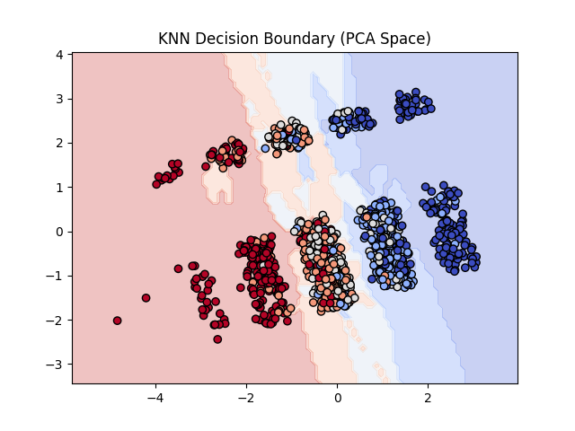
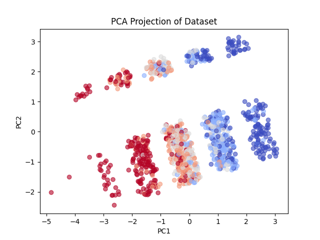
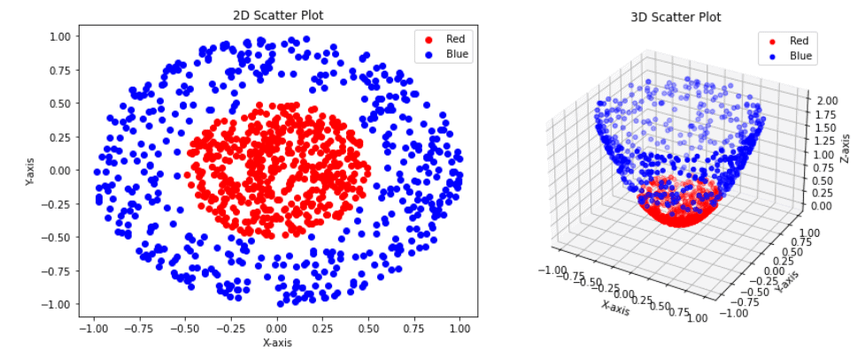

# K-Nearest Neighbors (KNN) from Scratch — Python & NumPy

This repository contains a **from-scratch implementation of the K-Nearest Neighbors (KNN) algorithm**  
using only **Python and NumPy**, without any machine learning libraries.

It includes a **realistic synthetic dataset of houses** with multiple features, scaling, and optional PCA visualization for insights.

<p>
  
</p>

## 🎯 Goal

To deeply understand:

- How distance-based classification works
- The role of similarity metrics in supervised learning
- How the choice of **K** affects bias–variance tradeoff
- Why KNN has no explicit training phase
- How preprocessing (scaling, PCA) affects model performance

## 🧠 Algorithm Overview

KNN is a **supervised, non-parametric, lazy learning** algorithm.

### Core Idea

1. Store all training samples
2. For a new input point:
   - Compute distance to all training points (**Euclidean** or **Manhattan**)
   - Select the **K nearest neighbors**
   - Predict the label using **majority voting**

## ✏️ Mathematical Intuition

### Distance Metrics

- **Euclidean distance**:
```math
\begin{align}
& \hspace{18cm} \\
& d(x, xᵢ) = √(∑(x − xᵢ)²)
\end{align}
```

<br>

- **Manhattan distance**:
```math
\begin{align}
& \hspace{18cm} \\
& d(x,y)=∑∣xi​−yi​∣
\end{align}
```

<br>

<p>
  
</p>

### Prediction Rule
ŷ = most frequent label among the K nearest neighbors

---

## 🏡 Dataset Scenario

- Synthetic housing dataset with **1200 samples**
- Features:
  - Area (m²), Rooms, Building Age, Distance to City Center
  - Floor, Elevator, Parking
- Target: **Price Category (5 classes: Economy → Luxury)**
- Includes realistic noise and overlapping classes
- Suitable for KNN, visualization, and PCA exploration

<p>
  
</p>

## 🔍 Preprocessing Steps

- **Feature Scaling (Standardization)**  
  Required because K-Means is distance-based

- **PCA**  
  PCA was applied before clustering to reduce dimensionality and noise.
  While this may affect interpretability, it improves cluster compactness and visualization clarity.

<p>
  
  
</p>


## 📊 Observations & Results

- **Small K values**:
  - Low bias
  - High variance
  - Sensitive to noise
- **Large K values**:
  - Smoother decision boundary
  - Potential underfitting
- Scaling and PCA clearly show **clusters and separability**
- Distance metric choice affects nearest neighbor selection

## ✅ Advantages

- Very simple to understand and implement
- No explicit training phase
- Works well on small to medium datasets
- Highly interpretable
- Provides clear insight with visualization

## ❌ Disadvantages

- Slow inference on large datasets (**O(n)**)
- High memory usage (stores all data)
- Sensitive to noisy data
- Strongly affected by feature scaling
- Choosing K is non-trivial

## 🛠 Tech Stack

- Python  
- NumPy (for calculation and data manipulation)  
- Matplotlib (for visualization and debugging)  

---

## 🚀 Why this project?

This project demonstrates **understanding, not abstraction**.  
It shows my ability to:

- Implement algorithms from scratch
- Handle preprocessing and dimensionality reduction
- Reason about bias–variance tradeoff and distance metrics
- Visualize high-dimensional data intuitively
